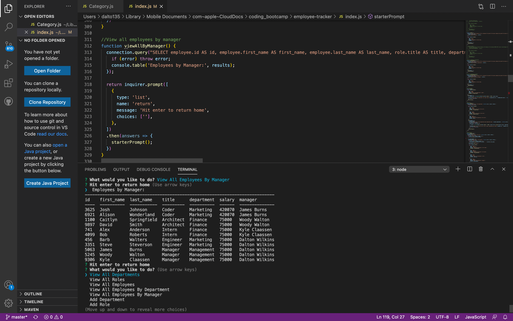

# Employee Tracker

## Table of Contents
[Video Link](#Link)  
[Screenshot](#Screenshot)  
[Technologies](#Technologies)  
[Description](#Description)  
[License](#License)  
[Contact](#Contact)

## Link
https://drive.google.com/file/d/1PRgjvLbEubjJbmaixVOPNbvKF6S-0zwB/view

## Screenshot

## Technologies
Javascript, Node, Inquirer, dotenv

## Description
A program that uses Node and Inquirer to manipulate a SQL database of employees, departments and employee roles. Users can add and view departments, roles and employees, as well as update employee roles and managers, delete departments, roles and employees, and view the utilized budget of a department. Users can also view employees by department or manager.

## License
MIT

## Contact
Dalton Wilkins - wilkins.271@osu.edu
